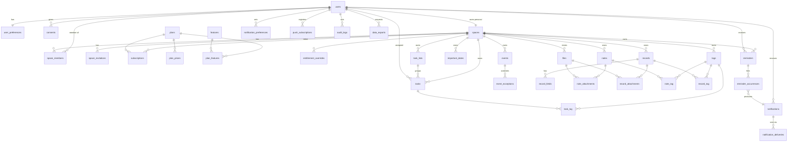

# 11. Entity Relationship Diagram (Phase 1 + platform)

```mermaid
erDiagram
  users ||--|| user_preferences : has
  users ||--o{ consents : gives
  users ||--o{ space_members : "member of"
  spaces ||--o{ space_members : has
  spaces ||--o{ space_invitations : has
  users ||--|| spaces : "owns personal"
  spaces ||--o{ subscriptions : billed
  plans ||--o{ subscriptions : ""
  plans ||--o{ plan_prices : ""
  plans ||--o{ plan_features : ""
  features ||--o{ plan_features : ""
  spaces ||--o{ entitlement_overrides : ""
  spaces ||--o{ task_lists : owns
  spaces ||--o{ tasks : owns
  task_lists ||--o{ tasks : groups
  users ||--o{ tasks : "assigned"
  spaces ||--o{ events : owns
  events ||--o{ event_exceptions : overrides
  spaces ||--o{ important_dates : owns
  spaces ||--o{ notes : owns
  spaces ||--o{ records : owns
  records ||--o{ record_fields : has
  spaces ||--o{ files : stores
  notes ||--o{ note_attachments : ""
  files ||--o{ note_attachments : ""
  records ||--o{ record_attachments : ""
  files ||--o{ record_attachments : ""
  spaces ||--o{ tags : owns
  tags ||--o{ task_tag : ""
  tasks ||--o{ task_tag : ""
  tags ||--o{ note_tag : ""
  notes ||--o{ note_tag : ""
  tags ||--o{ record_tag : ""
  records ||--o{ record_tag : ""
  spaces ||--o{ reminders : owns
  users ||--o{ reminders : receives
  reminders ||--o{ reminder_occurrences : fires
  users ||--o{ notifications : receives
  notifications ||--o{ notification_deliveries : "sent via"
  reminder_occurrences }o--|| notifications : produces
  users ||--o{ notification_preferences : sets
  users ||--o{ push_subscriptions : registers
  users ||--o{ audit_logs : acts
  users ||--o{ data_exports : requests
```
Reminders → (task | event | important_date | record) is a logical reference through `source_type/source_id` and is not drawn as an FK.
